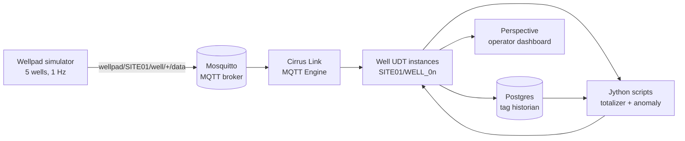

# Architecture

## Data flow



## Topic structure

Plain JSON over MQTT. Topic hierarchy intentionally Sparkplug-friendly so a swap to Sparkplug B is mechanical (Cirrus Link's encoder + topic remap, no business-logic changes).

| Topic | Direction | Payload |
|---|---|---|
| `wellpad/SITE01/well/{well_id}/data` | sim → broker | telemetry JSON |
| `wellpad/SITE01/control/fault` | operator → sim | fault command JSON |

### Telemetry payload

```json
{
  "timestamp": 1736100000.123,
  "well_id": "WELL_03",
  "online": true,
  "tubing_pressure_psi": 1183.42,
  "casing_pressure_psi": 1242.87,
  "flow_rate_mcfd": 1234.10,
  "cumulative_volume_mcf": 152.0314,
  "tank_level_pct": 47.21,
  "wellhead_temp_f": 122.45
}
```

### Fault payload

```json
{"well_id": "WELL_03", "fault_type": "pressure_spike", "duration_s": 30}
```

## Component decisions

### Why MQTT (and not OPC-UA or Modbus)

The JD lists MQTT alongside Modbus, OPC, and proprietary protocols. MQTT was chosen here because:

1. **Modern O&G deployments are MQTT-first** for cellular-connected wellpads — bandwidth is metered, MQTT's pub/sub model + small payloads beat OPC-UA over flaky LTE.
2. **Free** Cirrus Link MQTT Engine in Maker Edition. OPC-UA module costs.
3. **Sparkplug B is the industry direction**. This demo uses plain JSON for setup speed, with a topic hierarchy that drops cleanly into Sparkplug.

### Why Postgres for the historian

Ignition's built-in Tag Historian supports any JDBC database. Postgres because:

- Free, open source, well-documented JDBC driver
- Same database many integrators already run for non-historical project data
- Avoids the hassle of standing up MS SQL on Windows for a demo

For production, MS SQL is more common in enterprise O&G environments — wiring is identical, only the JDBC URL changes.

### Why UDTs over hand-rolled tag groups

Three reasons, in priority order:

1. **Schema versioning.** Add a new sensor to a UDT once, every well inherits it. Hand-rolled groups require a manual edit per well — error-prone at 50+ wells.
2. **Dashboard reuse.** A single Perspective view bound to `{wellId}` parameter renders any well. No copy-paste.
3. **Alarm consistency.** Alarm thresholds defined on the UDT cannot drift across wells. Auditors love this.

This matches the JD bullet: *"Create standards for SCADA development that provide governance on how to scale across projects for rapid deployment."*

## Upgrade path: Sparkplug B

Replace the simulator's MQTT publisher with `tahu`'s `mqtt_spb_wrapper` and emit `NBIRTH/DBIRTH` plus `DDATA` messages. Topic structure becomes:

```
spBv1.0/{group_id}/DDATA/{edge_node}/{device_id}
```

Cirrus Link's MQTT Engine auto-discovers the Sparkplug hierarchy and creates tags without manual mapping — the work that's manual in this MVP becomes automatic.
